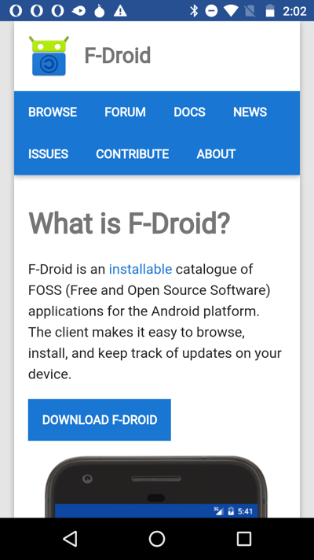
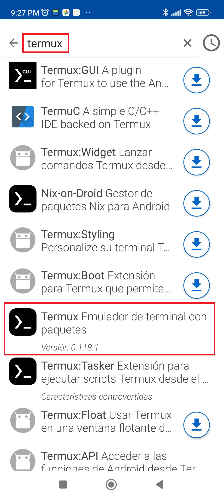

# Installing and Running `add-points-synthesize` on Android with Termux

This guide provides step-by-step instructions on how to install and run the `add-points-synthesize` project on an Android device using Termux.

## 1. Introduction

**Termux** is an Android terminal emulator and Linux environment application that works directly with no rooting or setup required.  It allows you to run a command-line environment on your Android device, essentially turning your phone into a mini-Linux machine.

This is important for running the `add-points-synthesize` project on Android because:

*   **Python Environment:** Termux provides a way to install and run Python, which is the primary language used in the project.
*   **Dependency Management:**  It enables you to install project dependencies (libraries and packages) using package managers like `pip`.
*   **Portability:**  It allows you to work on your project from your Android device, making development more accessible.

## 2. Installing F-Droid

F-Droid is a free and open-source software repository for Android, similar to the Google Play Store.  It's recommended for installing Termux.

1.  **Enable "Install from Unknown Sources":**  Before installing F-Droid, you might need to enable installing apps from unknown sources in your device's settings. The exact wording and location of this setting may vary depending on your Android version.  Typically, you can find it under:
    *   Settings -> Apps & notifications -> Special app access -> Install unknown apps.
    *   Settings -> Security -> Install apps from unknown sources.
    *  Enable the toggle for your browser (e.g., Chrome or Firefox).

2.  **Download F-Droid:**  Open your web browser and go to the official F-Droid website: [https://f-droid.org/](https://f-droid.org/)

3.  **Download the APK:**  Click the "Download F-Droid" button to download the F-Droid APK file.

4.  **Install F-Droid:**  Once the download is complete, open the APK file. You may be prompted with a warning about installing apps from unknown sources. Follow the prompts to install F-Droid.

    

## 3. Installing Termux

1.  **Open F-Droid:** Launch the F-Droid app you just installed.

2.  **Update Repositories:**  F-Droid may take a few minutes to update its repositories the first time you open it. Be patient and let it finish.

3.  **Search for Termux:** Tap the search icon (usually a magnifying glass) and type "Termux".

    

4.  **Install Termux:**  Select the official Termux app from the search results and tap the "Install" button.

5.  **Grant Permissions (if prompted):** Termux might request storage permission. Grant it if needed by the project.

## 4. Setting up Python

1.  **Open Termux:** Launch the Termux app.

2.  **Update Packages:** Run the following commands to update the package list and upgrade existing packages:

    ```bash
    pkg update
    pkg upgrade
    ```

    Answer "y" when prompted to confirm the upgrade.

3.  **Install Python:** Install Python using the following command:

    ```bash
    pkg install python
    ```

    This installs the latest available Python version.  For this project, any Python 3 version should work.  You can check the installed version with:

    ```bash
    python --version
    ```

4. **Install pip:** pip may not be automatically installed. Install it using:

    ```bash
    pkg install python-pip
    ```

## 5. Installing Project Dependencies

1.  **Clone the Repository:** Navigate to the directory where you want to store the project.  A good default is your home directory. Clone the repository using `git`:

    ```bash
    git clone https://github.com/sght500/add-points-synthesize
    ```

    If you don't have `git` installed, install it with `pkg install git`.

2.  **Navigate to the Project Directory:** Change your current directory to the cloned repository:

    ```bash
    cd add-points-synthesize
    ```

3.  **Install Dependencies:**  This project has a `requirements.txt` file listing the required dependencies. Install them using `pip`:

    ```bash
    pip install -r requirements.txt
    ```

## 6. Running the Project

1.  **Navigate to the Project Directory (if you're not already there):**

    ```bash
    cd add-points-synthesize
    ```

2.  **The Main Script:** The main script that runs the project is `add-points-tts.py`.

    More information is available in the project's [README](README.md) file.

3.  **Run the Project:** Execute the main script using Python:

    ```bash
    python add-points-tts.py
    ```

4. Follow the command-line instructions given by the program.

## 7. Troubleshooting

*   **"pkg" command not found:** Ensure you have an internet connection and that Termux is properly installed.
*   **"pip" command not found:** Make sure Python and `python-pip` are correctly installed.  Try reinstalling them: `pkg install python python-pip`.  You might need to close and reopen Termux after installing.
*   **"ModuleNotFoundError: No module named '...'":** This means a required dependency is missing.  Double-check the `requirements.txt` file and ensure you've installed all the dependencies. Use `pip install <missing_module_name>` to install the missing module.
*   **Permission Denied:** If you encounter permission errors when trying to access files, ensure that Termux has the necessary storage permissions.  You can grant permissions in your Android device's settings under "Apps" -> "Termux" -> "Permissions". Also, remember that Termux has its own file system. You'll need to navigate to the correct directory (usually within `~/storage/shared` to access your device's files)
*   **Termux Crashing:** This can happen if Termux runs out of memory or encounters an unhandled error. Try closing other apps to free up memory.  If the issue persists, try reinstalling Termux.
*   **Git Errors:** If you encounter git errors during the cloning process, ensure that you have git installed properly by running `pkg install git`
*   **Network Issues:** If you are having issues downloading packages or cloning the repository, check your network connection.

If you encounter other issues, search for solutions online or consult the Termux documentation: [https://wiki.termux.com/wiki/Main_Page](https://wiki.termux.com/wiki/Main_Page).

---
